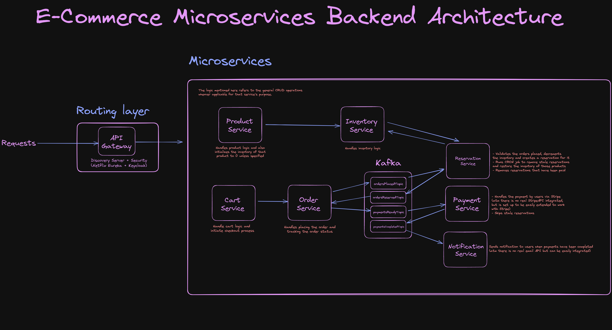

## Backend Architecture

## How to run 
1. Clone this project and use your IDE of choice (IntelliJ is recommended)
2. This project uses MongoDB for product storage and MySQL for the rest, insert your own MongoDB and MySQL credentials in each services' .env file.
3. Make sure Docker and Postman are both installed.
4. Run `docker compose up -d` to get Keycloak and Kafka running.
5. Start all the services. A convenient way to do so is go to `Run` -> `Edit Configurations` and add all of the services' application, and press `OK`. Press `Alt+8`, select all of the services added earlier and press the green button to start.
6. Open Postman and head to your browser's `http://localhost:8181` and click into Keycloak's administrator console, sign in with `username=admin` and `password=admin`.
7. Under `Clients` go to `spring-cloud-client -> Credentials` and copy the client secret.
8. Now go to `Realm Settings` and press `OpenID Endpoint Configuration`, copy the `token_endpoint` URL.
9. Go to Postman's `Authorization` tab, set type to `OAuth 2.0` and under `Configure New Token`, set the properties as below:   
- `Grant Type = Client Credentials`
- `Access Token URL = {the token endpoint copied earlier}`
- `Client ID = spring-cloud-client`
- `Client Secret = {the client secret copied earlier}`
10. Press `Get New Access Token` and press `Use Token`.
11. Now you can start making requests to the endpoints, do remember to get new access tokens from time to time as the token would expire.

